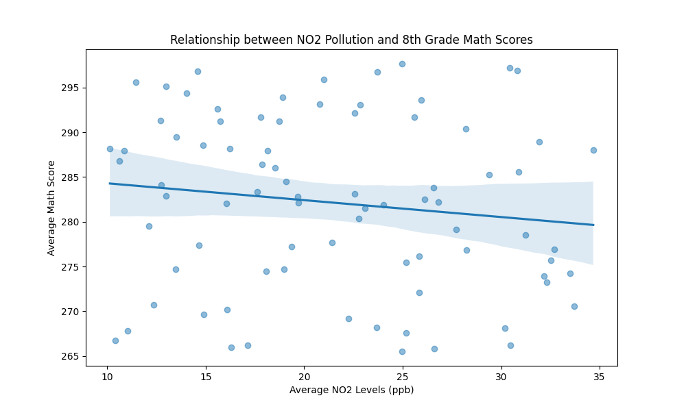
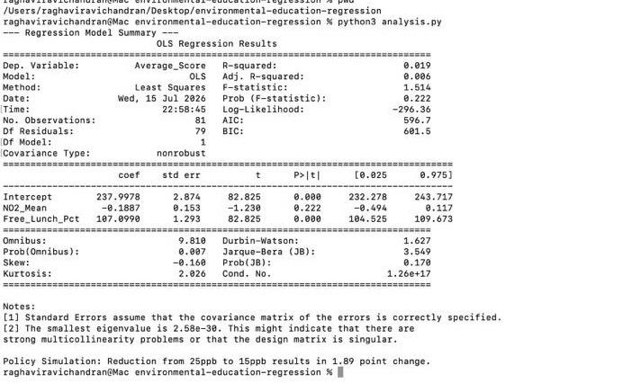

# Environmental Education Regression Analysis

This project implements a full end-to-end data science pipeline to analyze the relationship between air quality ($NO_2$ levels) and 8th-grade math performance. This analysis provides a quantitative framework for understanding how environmental factors may influence educational outcomes.

## Project Overview
This repository features a complete technical pipeline:
* **Data Engineering:** A custom script for generating synthetic, realistic environmental and educational datasets.
* **Statistical Modeling:** An Ordinary Least Squares (OLS) regression model to quantify the correlation between pollutants and test scores while controlling for socioeconomic variables.
* **Policy Simulation:** A predictive tool to estimate the impact of hypothetical air quality improvements on student performance.
* **Data Visualization:** Automated plotting of regression trends to facilitate data-driven decision-making.

## Key Insights
The regression analysis yielded the following findings:
* **Model Significance:** A negative correlation was identified between $NO_2$ levels and math performance (coefficient: $-0.1887$).
* **Policy Impact:** Our model simulates that a reduction of air pollution from $25\text{ ppb}$ to $15\text{ ppb}$ could yield a **$1.89$-point increase** in average math scores.

## Visualizations
**Regression Trend Analysis:**


**Statistical Model Summary:**


## Repository Structure
- `analysis.py`: Contains the core OLS regression logic and policy simulation engine.
- `generate_mock_data.py`: Script for generating the underlying synthetic study data.
- `visualize.py`: Script for rendering regression trend plots.
- `requirements.txt`: List of required Python dependencies.

## How to Run
1. **Clone the repository:**
   ```bash
   git clone [https://github.com/Raghavi-R12/environmental-education-regression.git](https://github.com/Raghavi-R12/environmental-education-regression.git)
   cd environmental-education-regression

   pip install -r requirements.txt (Install dependencies)
   
Execution of pipeline:-

   python3 generate_mock_data.py
python3 analysis.py
python3 visualize.py

Author
Raghavi Ravichandran


### Steps to complete:
1. Ensure your files (`requirements.txt`, `pollution_vs_math.png`, and `analysis_output.png`) are already uploaded to your repo.
2. Go to your repo, click **Add file > Create new file**.
3. Name it **`README.md`**.
4. Paste the content above.
5. Click **Commit changes**.
